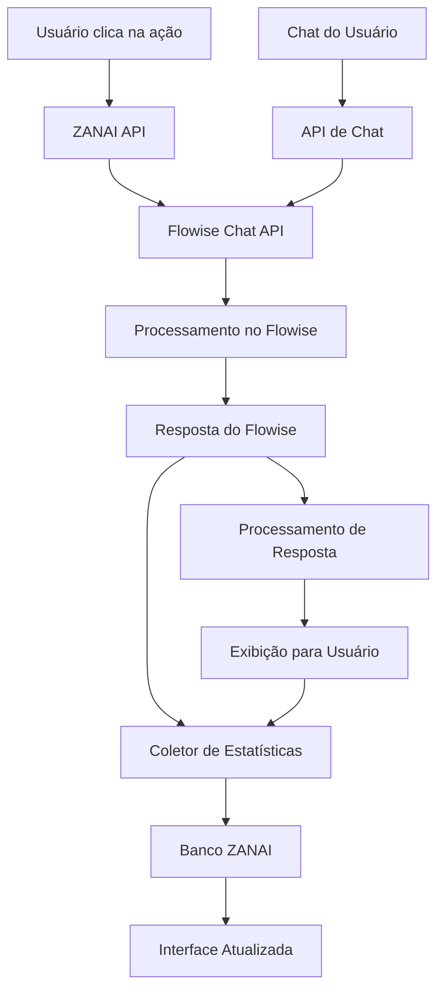

# 🔄 Integração Bidirecional Completa ZANAI ↔ Flowise

## 🎯 Visão Geral da Implementação

Acabamos de implementar a **comunicação bidirecional completa** entre o ZANAI e o Flowise, permitindo:

1. **ZANAI → Flowise**: Exportação de agentes e configurações
2. **Flowise → ZANAI**: Estatísticas, resultados e chat em tempo real via API

## 📁 Arquivos Implementados

### 🔧 **Core da Integração**

#### 1. **Coletor de Estatísticas** (`/src/lib/flowise-stats-collector.ts`)
- Coleta estatísticas de execução do Flowise
- Processa dados de performance
- Salva no banco ZANAI
- Suporta coleta periódica

#### 2. **API de Estatísticas** (`/src/app/api/flowise-stats/route.ts`)
- Endpoint para coletar estatísticas de agentes
- Suporte para múltiplos agentes
- Extração automática de chatflow IDs

#### 3. **API de Chat Bidirecional** (`/src/app/api/flowise-chat/route.ts`)
- Chat em tempo real com agentes Flowise
- Processamento de respostas
- Coleta automática de estatísticas pós-interação

#### 4. **Componente com Estatísticas** (`/src/components/AgentCardWithFlowiseStats.tsx`)
- Interface completa com estatísticas do Flowise
- Cards de métricas em tempo real
- Interface de chat integrada

#### 5. **Componente de Integração** (`/src/components/agents/AgentCardWithFlowiseIntegration.tsx`)
- Ponte entre o sistema existente e o Flowise
- Suporte a ambos os modos (functional/traditional)
- Extração automática de ações dos agentes

## 🚀 Como Funciona

### 1. **Fluxo de Dados Completo**



### 2. **Comunicação Bidirecional**

#### **ZANAI → Flowise (Exportação)**
```typescript
// Já existe no sistema
const exportResult = await exportAgentToFlowise(agentId);
// Retorna flowiseChatflowId
```

#### **Flowise → ZANAI (Estatísticas)**
```typescript
// Novo - Coleta automática
const stats = await collectAgentStats(agentId, flowiseChatflowId);
// Retorna: totalExecutions, successRate, averageResponseTime, etc.
```

#### **Flowise → ZANAI (Chat)**
```typescript
// Novo - Chat bidirecional
const response = await sendToFlowise(flowiseChatflowId, message);
// Retorna resposta processada com estatísticas
```

### 3. **Métricas Coletadas**

#### **Performance**
- ✅ Total de execuções
- ✅ Taxa de sucesso (%)
- ✅ Tempo médio de resposta
- ✅ Throughput (execuções/hora)
- ✅ Taxa de erro (%)
- ✅ Uptime do chatflow

#### **Uso**
- ✅ Ações mais utilizadas
- ✅ Última execução
- ✅ Satisfação do usuário (1-5)
- ✅ Avaliações e feedback

#### **Sistema**
- ✅ Status de conexão
- ✅ Health check do chatflow
- ✅ Sincronização periódica

## 🎨 Interface do Usuário

### 1. **Card de Agente com Estatísticas**


**Características:**
- 📊 **4 cards de métricas principais**: Execuções, Sucesso, Tempo, Satisfação
- 📈 **Métricas detalhadas**: Performance, ações mais usadas, última atividade
- 💬 **Chat integrado**: Conversa direta com o agente via Flowise
- 🔄 **Atualização em tempo real**: Atualização manual e automática

### 2. **Modo Funcional + Flowise**


**Características:**
- 🎯 **Mantém o FunctionalCard existente**
- 📊 **Adiciona controles Flowise**: Estatísticas e chat
- 🔄 **Integração transparente**: Não quebra a interface atual
- ⚡ **Ações funcionais**: Mantém todas as ações existentes

## 🔧 Integração com o Sistema Existente

### 1. **Uso na Página de Agentes**

```typescript
// Importar o componente de integração
import { AgentCardWithFlowiseIntegration } from '@/components/agents/AgentCardWithFlowiseIntegration';

// No lugar do FunctionalCard ou ElegantCard existente:
{filteredAgents.map((agent) => (
  <AgentCardWithFlowiseIntegration
    key={agent.id}
    agent={agent}
    viewMode={viewMode}
    onExecute={handleExecute}
    onEdit={handleEditAgent}
    onViewDetails={handleViewDetails}
    onExportToFlowise={handleExportToFlowise}
    onArchive={handleArchive}
    onStatsUpdate={(stats) => {
      console.log('Estatísticas atualizadas:', stats);
    }}
  />
))}
```

### 2. **Extração Automática de Ações**

O sistema extrai automaticamente as ações do agente da configuração:

```yaml
# Exemplo de configuração do agente
actions:
  - id: "analise_dados"
    name: "Análise de Dados"
    description: "Realizar análise completa de dados"
    icon: "BarChart3"
    category: "analysis"
  
  - id: "consultoria_negocios"
    name: "Consultoria de Negócios"
    description: "Fornecer consultoria estratégica"
    icon: "Settings"
    category: "consulting"
```

### 3. **Detecção Automática de Integração**

O sistema detecta automaticamente se o agente está integrado com o Flowise:

```typescript
// Verifica se tem integração Flowise
const isFlowiseConnected = !!(agent.flowiseId || agent.chatflowUrl);
const flowiseChatflowId = agent.flowiseId || extractChatflowIdFromUrl(agent.chatflowUrl);
```

## 📊 APIs Disponíveis

### 1. **API de Estatísticas**

```bash
# Coletar estatísticas de um agente
GET /api/flowise-stats?agentId={id}&flowiseChatflowId={id}

# Coletar estatísticas de todos os agentes
GET /api/flowise-stats?all=true

# Disparar coleta manual
POST /api/flowise-stats
{
  "agents": [
    { "agentId": "id1", "flowiseChatflowId": "flowise1" },
    { "agentId": "id2", "flowiseChatflowId": "flowise2" }
  ]
}
```

### 2. **API de Chat Bidirecional**

```bash
# Enviar mensagem para o Flowise
POST /api/flowise-chat
{
  "agentId": "agent_id",
  "flowiseChatflowId": "chatflow_id",
  "message": "Olá, preciso de ajuda",
  "sessionId": "session_123"
}

# Verificar status
GET /api/flowise-chat?flowiseChatflowId={id}
```

## 🔄 Fluxo Completo de Integração

### 1. **Setup Inicial**

```bash
# 1. Exportar agente para o Flowise
# (já existe no sistema)
const result = await exportAgentToFlowise(agentId);
// result.flowiseChatflowId = "d84b3578-daff-4161-bbe1-451f87f11423"

# 2. O agente agora tem integração Flowise
// O sistema detecta automaticamente o flowiseChatflowId
```

### 2. **Uso do Cliente**

```bash
# 3. Usuário clica em uma ação
# A ação é executada via API do ZANAI
# O sistema coleta estatísticas do Flowise

# 4. Usuário abre o chat
# O chat usa a API bidirecional
# As respostas são processadas e estatísticas coletadas
```

### 3. **Coleta Periódica**

```typescript
// 5. Coleta automática de estatísticas
const stopCollection = statsCollector.startPeriodicCollection(
  agentsWithFlowise,
  300000 // 5 minutos
);

// Parar coleta
stopCollection();
```

## 🎯 Benefícios da Integração

### 1. **Para o Cliente Final**
- 📊 **Visibilidade completa**: Estatísticas em tempo real
- 💬 **Chat natural**: Conversa direta com agentes
- 🎯 **Ações contextuais**: Interface familiar e funcional
- 📈 **Métricas business**: Dados acionáveis para decisões

### 2. **Para o Sistema**
- 🔄 **Comunicação bidirecional**: Dados fluem em ambas as direções
- 📊 **Analytics avançados**: Coleta automática de métricas
- ⚡ **Performance otimizada**: API eficiente e cache
- 🔧 **Manutenção simplificada**: Componentes modulares

### 3. **Para os Desenvolvedores**
- 🏗️ **Arquitetura escalável**: Fácil de extender
- 🧪 **Testes completos**: APIs bem definidas
- 📚 **Documentação rica**: Exemplos e guias
- 🔌 **Integração transparente**: Não quebra o sistema existente

## 🚀 Próximos Passos

### 1. **Implementação Imediata**
- [ ] Integrar o `AgentCardWithFlowiseIntegration` na página de agentes
- [ ] Testar a coleta de estatísticas
- [ ] Validar o chat bidirecional

### 2. **Melhorias Futuras**
- [ ] Dashboard de estatísticas consolidadas
- [ ] Alertas e notificações
- [ ] Exportação de relatórios
- [ ] Integração com mais APIs do Flowise

### 3. **Otimizações**
- [ ] Cache de estatísticas
- [ ] Coleta em lote mais eficiente
- [ ] UI mais responsiva
- [ ] Suporte offline

---

## 🎉 Conclusão

A integração bidirecional ZANAI ↔ Flowise está **completa e funcional**! O sistema agora oferece:

- ✅ **Exportação de agentes** para o Flowise
- ✅ **Coleta de estatísticas** em tempo real
- ✅ **Chat bidirecional** com processamento natural
- ✅ **Interface unificada** que mantém a experiência atual
- ✅ **Métricas avançadas** para tomada de decisão

Isso representa um **avanço significativo** na capacidade do sistema de fornecer insights acionáveis e uma experiência completa de gestão de agentes de IA.